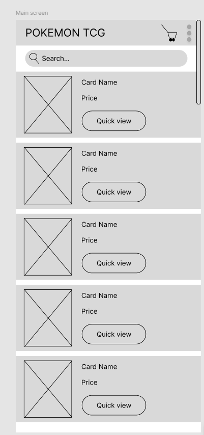
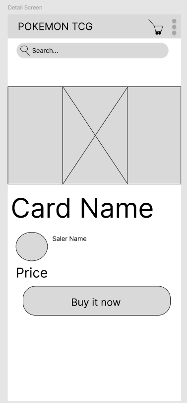
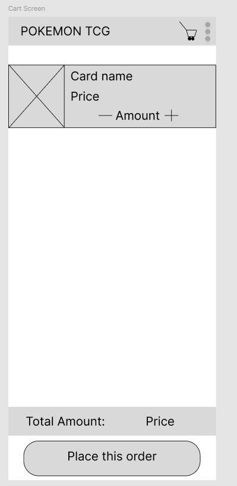

# CardGameMarketplace

## What does the app do?  
This application is a platform for trading and buying/selling Pokémon TCG cards. It allows players to easily search, trade, buy, and sell cards with other users.  

## Key Features  
- **Card Search & Management**: Users can search for cards by name, expansion set, rarity, price, etc.  
- **Trade & Marketplace**: Users can list cards for sale or find trading partners.  
 
   
- **Shopping Cart**: Allows users to add multiple cards to a cart before purchasing.  
    
- **Notifications**: Uses `BroadcastReceiver` to notify users about successful transactions or new messages.  

## Why is it useful?  
- **Saves Time**: Instead of searching across multiple platforms, users can find the cards they need in one place.   
- **Community Engagement**: Connects Pokémon TCG enthusiasts, making it easier to find trading partners.  

## 

# Key Features & Components  

## Key Features  
- **Card Search & Filtering**: Allows users to find cards based on name, set, rarity, and price.  
- **Trade & Marketplace**: Users can list cards for sale or trade and negotiate deals with others.    
- **Push Notifications**: Uses `BroadcastReceiver` to notify users about successful transactions or messages.  
- **Inventory Management**: Helps sellers track available and sold cards.  

## System Components  
The system consists of several core components:  

1. **Frontend (Android App)**  
   - Built with **Java (Android)**  
   - UI for browsing, trading, and managing inventory  

2. **Backend (Server & Database)**  
   - **API Service**: Handles requests for searching, trading, and user management  
   - **Database**: Stores card data, user profiles, transaction history  
   - Possible options: Firebase (for real-time updates) or a custom RESTful API  

3. **External API for Card Data**  
   - Fetches Pokémon TCG card details from an external database  

4. **Payment Service**  
   - Processes transactions securely  
   - Could integrate Stripe, PayPal, or a custom payment gateway  

5. **Notification System**  
   - Uses `BroadcastReceiver` to handle transaction updates and chat messages  

## UML Diagram (Conceptual Overview)  

# Web Service Information  

## Data Sources  
The application retrieves data from multiple sources:  
1. **Pokémon TCG API** - Provides card details such as name, set, rarity, and pricing.  
2. **Internal Database** - Stores user profiles, inventory, transaction history, and trade listings.  

## API Endpoints  

### 1. Pokémon TCG API  
Used for fetching card details.  
- **Base URL:** `https://api.pokemontcg.io/v2`  
- **Endpoints:**  
  - `GET /cards/{id}` → Get details of a specific card.  
  - `GET /cards?q=name:{name}` → Search for cards by name.  
  - `GET /sets` → Retrieve all card sets.  

### 2. Internal API (Custom Backend)  
Used for user authentication, inventory management, and trading.  
- **Base URL:** `https://localhost/myserver/api`  
- **Endpoints:**  
  - `GET /users/{id}` → Retrieve user profile.  
  - `GET /inventory/{userId}` → Get user's card inventory.   
  - `POST /charges` → Create a new charge.
  - `GET /charges/{id}` → Retrieve charge details.  

## Why These APIs?  
- **Pokémon TCG API** provides up-to-date card information.  
- **Custom Backend** allows full control over user data and transactions.  
 

